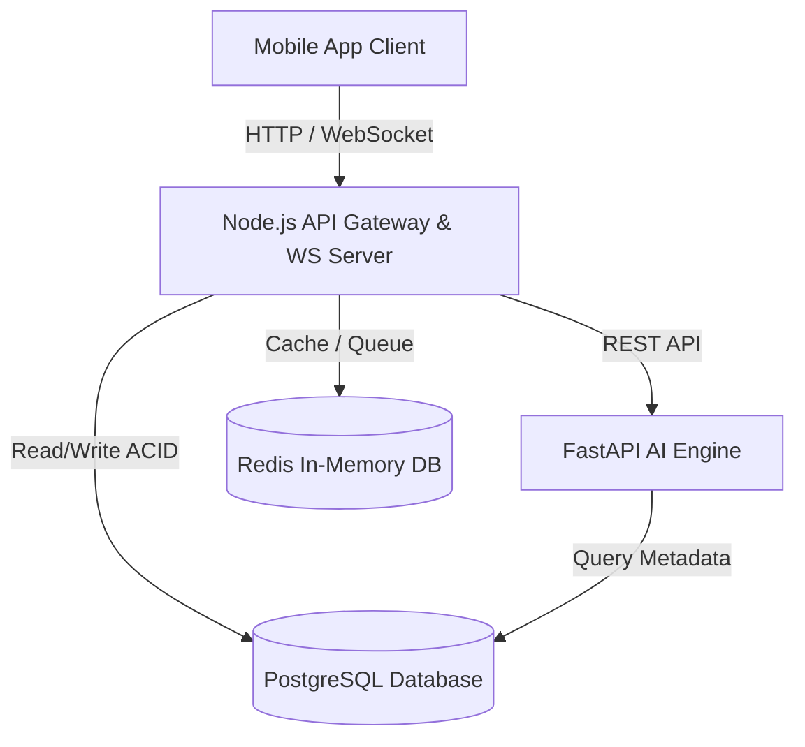
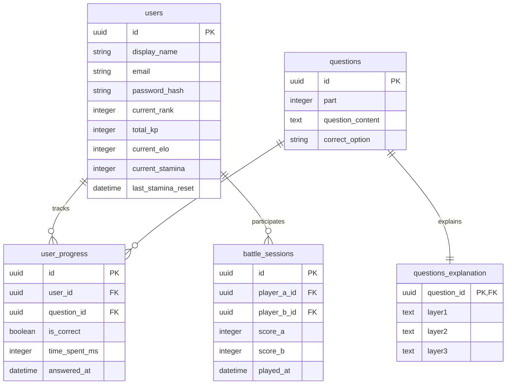

# Architecture Spine — TOEIC Quest RPG Hub

## Design Paradigm

Ứng dụng tuân theo mô hình **Kiến trúc phân tầng (Layered Architecture)** kết hợp cơ chế giao tiếp **hướng sự kiện và thời gian thực (Event-Driven & Real-time)**:
*   **Mobile Frontend Layer (React Native/Flutter):** Quản lý UI/UX, xử lý animation mượt mà (Confetti, Rank-up Ceremony) và kết nối WebSocket Socket.io cho PvP.
*   **API Gateway / Backend Service (Node.js):** Đảm nhiệm các RESTful API nghiệp vụ transactional, đồng bộ hóa cây kỹ năng, xác thực người dùng, và làm WebSocket Server chính cho PvP.
*   **Asynchronous Processing Queue (Redis):** Quản lý hàng đợi ghép cặp PvP (matchmaking), caching phiên làm việc thời gian thực và xử lý bất đồng bộ các tác vụ ghi nặng.
*   **AI Engine Layer (FastAPI):** Dịch vụ phân tích năng lực người dùng theo mô hình học thích ứng IRT, tính toán Theta score và gợi ý lộ trình học cá nhân hóa.

---

## Invariants & Rules

Hệ thống tuân thủ sơ đồ phân hướng phụ thuộc (Dependency Direction):



### AD-1 — PostgreSQL and Redis Datastore Separation
*   **Binds:** `FR-1`, `FR-3`, `FR-4`, `FR-6`, `FR-14`, `FR-16`, `FR-17`
*   **Prevents:** Nghẽn cổ chai ghi cơ sở dữ liệu (I/O Bottleneck) và khóa bảng (table locks) trên PostgreSQL khi 100,000+ người dùng đồng thời cập nhật Leaderboard và tìm đối thủ PvP.
*   **Rule:** 
    *   Tất cả dữ liệu transactional (tài khoản người dùng, log bài học, giao dịch Premium, ngân hàng câu hỏi gốc, kết quả bài Dungeon) phải lưu trữ tại **PostgreSQL**.
    *   Tất cả dữ liệu tạm thời, phiên làm việc (session), trạng thái ghép cặp PvP, và thứ hạng Leaderboard tuần phải lưu trữ và xử lý trực tiếp tại **Redis**.

### AD-2 — WebSocket Real-Time Messaging and Redis Pub/Sub
*   **Binds:** `FR-11`, `FR-12`, `FR-14`
*   **Prevents:** Giới hạn kết nối của máy chủ đơn lẻ và độ trễ truyền tin PvP vượt quá 500ms dưới tải trọng CCU lớn.
*   **Rule:** Sử dụng thư viện **Socket.io** chạy trên nền Node.js. Các máy chủ Node.js độc lập trong cụm (scaled-out) phải đồng bộ hóa trạng thái phòng đấu PvP qua cơ chế **Redis Pub/Sub**. Không được thực hiện truy vấn PostgreSQL trong suốt quá trình đấu PvP 10 câu hỏi.

### AD-3 — Server-Side Evaluation and Validation
*   **Binds:** `FR-2`, `FR-8`, `FR-13`
*   **Prevents:** Hack điểm, tự động chọn đáp án (auto-answer scripts), can thiệp client-side để thay đổi KP/ELO.
*   **Rule:** Client chỉ gửi mã đáp án đã chọn (`option_id`) và thời gian phản xạ (`time_spent` tính bằng ms). Server chịu trách nhiệm đối chiếu tính chính xác của đáp án, tính toán điểm KP dựa trên độ khó và hệ số streak, và xác nhận kết quả. Mọi câu trả lời gửi lên dưới 1.0 giây sẽ được ghi nhận và đưa vào cảnh báo gian lận.

### AD-4 — Asynchronous ELO Matchmaking
*   **Binds:** `FR-11`
*   **Prevents:** Treo kết nối HTTP (Request Timeout) và nghẽn tài nguyên server khi chờ ghép cặp đối thủ.
*   **Rule:** Hàng đợi tìm trận phải sử dụng cấu trúc **Redis Sorted Sets (ZSET)** với score là ELO của người chơi. Một tiến trình chạy ngầm (Worker) sẽ quét hàng đợi định kỳ (ví dụ: mỗi 1.5 giây) để ghép cặp tự động. Kết quả ghép cặp thành công sẽ được bắn ngược lại cho client qua kênh sự kiện WebSocket.

### AD-5 — Offline Explanation Pre-generation
*   **Binds:** `FR-9`
*   **Prevents:** Chi phí gọi API của mô hình ngôn ngữ lớn (LLM) tăng đột biến và độ trễ phản hồi Micro-feedback vượt quá 2 giây.
*   **Rule:** Toàn bộ nội dung giải thích 3 tầng của ngân hàng câu hỏi TOEIC phải được chạy tiền sinh (pre-generated) offline bằng LLM và import sẵn vào bảng `questions_explanation` của PostgreSQL. Cấm gọi API LLM trực tuyến (real-time) tại thời điểm người học làm Daily Quest thông thường.

### AD-6 — Daily Stamina limit on PvP matches
*   **Binds:** `FR-6`, `FR-7`, `FR-14`
*   **Prevents:** Rủi ro lạm dụng trò chơi (Pointsification), kiệt sức người học (burnout), và lạm phát điểm ELO.
*   **Rule:** Mỗi tài khoản có trường dữ liệu `stamina`. Tài khoản thường (Free) giới hạn 15 trận PvP/ngày; tài khoản Premium giới hạn 30 trận PvP/ngày. Mỗi trận PvP làm giảm 1 Stamina. Điểm Stamina được reset về mặc định vào lúc 00:00 theo giờ hệ thống của máy chủ.

### AD-7 — Dungeon Auto-Save Checkpoints
*   **Binds:** `FR-15`, `FR-16`, `FR-17`
*   **Prevents:** Mất mát toàn bộ tiến độ làm bài thi thử dài 2 tiếng (200 câu) khi người dùng bị ngắt mạng hoặc tắt app ngầm.
*   **Rule:** Kết quả chọn đáp án của Dungeon Mock Test bắt buộc phải được đồng bộ và lưu trữ (Checkpoint) vào bảng `dungeon_draft_answers` trên PostgreSQL sau mỗi **10 câu hỏi**. Khi người dùng kết nối lại, hệ thống khôi phục bài làm từ checkpoint gần nhất.

### AD-8 — OAuth2 Authentication & Data Encryption
*   **Binds:** `FR-1`, `FR-3`
*   **Prevents:** Rò rỉ thông tin người dùng và xâm phạm tài khoản trái phép.
*   **Rule:** Sử dụng OAuth2 kết hợp JWT (JSON Web Token) cho đăng nhập ứng dụng. Mật khẩu lưu trong DB phải được băm bằng thuật toán **bcrypt**. Các thông tin nhạy cảm của người dùng (email, thông tin IAP billing) phải được mã hóa ở mức cơ sở dữ liệu bằng thuật toán **AES-256**.

---

## Consistency Conventions

| Mối quan tâm (Concern) | Quy ước nhất quán (Convention) |
| --- | --- |
| **Đặt tên bảng CSDL** | Sử dụng định dạng `snake_case`, số nhiều (Ví dụ: `users`, `user_progress`, `questions_explanation`). |
| **Định dạng dữ liệu API** | Mọi REST API đều phải trả về định dạng JSON chuẩn: `{ "ok": boolean, "data": object/array, "error": { "code": string, "message": string } }`. |
| **Quản lý múi giờ** | Toàn bộ các mốc thời gian lưu trữ trong DB và gửi qua API phải tuân thủ định dạng chuỗi ISO 8601 kèm múi giờ UTC (Ví dụ: `2026-06-23T04:00:00Z`). |
| **Định danh UUID** | Khóa chính của bảng người dùng (`users`) và các session đấu PvP (`battle_sessions`) phải sử dụng định dạng UUID v4 để tránh rò rỉ dung lượng dữ liệu. |

---

## Stack

Hệ thống sử dụng các thành phần công nghệ với phiên bản cụ thể sau:

| Tên thành phần | Vai trò | Phiên bản |
| --- | --- | --- |
| **Node.js** | Backend API Gateway & RESTful Service | `v20.x LTS` |
| **FastAPI** | Python AI Engine Service (IRT) | `v0.110.x` |
| **PostgreSQL** | Database quan hệ chính (ACID) | `v16.x` |
| **Redis** | In-Memory Database (Queue & Cache) | `v7.x` |
| **React Native** | Mobile App Development Framework | `v0.73.x` |
| **Socket.io** | WebSocket framework kết nối real-time | `v4.7.x` |
| **bcrypt** | Thư viện băm bảo mật mật khẩu | `v5.1.x` |

---

## Structural Seed

### 1. Cấu trúc thư mục nguồn dự án đề xuất (Minimal Source Tree)

```text
{root}/
  _bmad/                    # Cấu hình BMad Method
  backend/                  # Backend code
    src/
      api/                  # REST API controllers
      websocket/            # Socket.io handlers & Redis Pub/Sub
      models/               # PostgreSQL database models
      services/             # Business Logic (Stamina, ELO recalculation)
  ai-engine/                # Python FastAPI code
    app/
      irt/                  # Thuật toán IRT scoring
      spaced_repetition/    # Thuật toán Spaced Repetition
  frontend/                 # React Native mobile client
    src/
      components/           # Reusable UI component (GlassPanel, KPBadge)
      screens/              # Màn hình chính (Home, PvP, SkillTree)
```

### 2. Mô hình thực thể cơ sở dữ liệu rút gọn (Core ERD Diagram)



---

## Capability → Architecture Map

| Tính năng trong PRD | Vị trí xử lý | Bị ràng buộc bởi quyết định (AD) |
| --- | --- | --- |
| **FR-2: Placement Test rút gọn** | `frontend/screens` & `backend/api` | `AD-3 (Server validation)` |
| **FR-6: Duy trì Streak hàng ngày** | `backend/services` | `AD-6 (Stamina limit)` |
| **FR-9: Giải thích 3 tầng** | `frontend/components` & `backend/api` | `AD-5 (Pre-generated explanations)` |
| **FR-11: Matchmaking ELO-based** | `backend/websocket` & `Redis` | `AD-4 (Redis queue matchmaking)` |
| **FR-12: Đồng bộ trận đấu PvP** | `backend/websocket` & `Socket.io` | `AD-2 (WebSocket scale-out)` |
| **FR-16: Tự động lưu nháp Dungeon** | `backend/api` & `PostgreSQL` | `AD-7 (Checkpoint every 10 q)` |
| **FR-17: Tính toán Sim Score qua IRT** | `ai-engine/irt` & `FastAPI` | `AD-1 (PostgreSQL database)` |

---

## Deferred

*   **Lựa chọn nhà cung cấp hạ tầng Cloud (AWS vs GCP):** Quyết định chọn AWS ECS/EKS hay Google GKE sẽ được bàn bạc và chốt ở giai đoạn lập kế hoạch hạ tầng triển khai dự án chi tiết tiếp theo.
*   **Thiết lập công cụ CI/CD pipeline (GitHub Actions vs GitLab CI):** Tạm hoãn đến khi dự án chính thức tuyển dụng đủ nhân sự DevOps chuyên trách.
