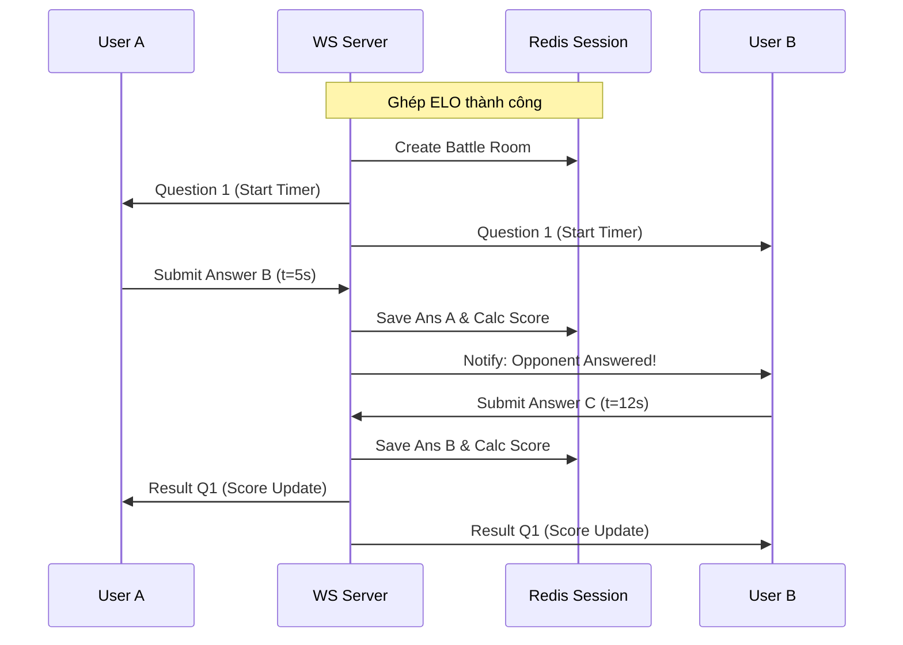

# 🏗️ Báo Cáo Khả Thi Kỹ Thuật & Cấu Trúc Hệ Thống (Technical Architecture Feasibility)
**Người thực hiện:** Winston (System Architect)  
**Dự án:** TOEIC Quest RPG Hub  
**Ngày lập:** 23/06/2026  
**Mã tài liệu:** ARCHREPORT_TOEIC_RPG_v1.0  

---

## I. Đánh Giá Khả Thi Công Nghệ (Core Tech Evaluation)

Kiến trúc đề xuất dựa trên mô hình kết hợp **PostgreSQL** (chứa dữ liệu có cấu trúc, quan hệ chặt chẽ) và **Redis** (cho xử lý tốc độ cao và xếp hàng thời gian thực). Chúng tôi sử dụng **Node.js** làm API Gateway và dịch vụ WebSocket, kết hợp với **FastAPI** cho AI Adaptive Engine.

---

## II. Các Thành Phần Kiến Trúc Cốt Lõi (Core Architectural Components)

### 1. Luồng PvP Real-time qua WebSocket (Latency ≤ 500ms)
Để đảm bảo trải nghiệm đối kháng mượt mà, cơ chế đồng bộ câu hỏi cần tuân thủ thiết kế sau:

*   **Sử dụng Redis Pub/Sub:** Khi hai người chơi ghép cặp ELO thành công, một `battle_session_id` được khởi tạo trong Redis.
*   **Cơ chế đẩy (Push Model):** Server sẽ broadcast câu hỏi qua kênh WebSocket. Thời gian làm bài (20s) được chạy đồng hồ ở cả Client và Server.
*   **Xác thực Server-side:** 
    *   *Trade-off:* Nếu để client gửi kết quả kèm theo điểm số, rủi ro gian lận rất lớn. Do đó, client chỉ gửi `answer_code` và `timestamp` (thời điểm chọn đáp án) lên server.
    *   *Xử lý:* Server tính toán độ chính xác và tính bonus tốc độ (Speed Bonus = `Base_KP * (1 - time_spent / 20)`).

### 2. Phân Tách Cơ Sở Dữ Liệu (PostgreSQL vs Redis)
*   **PostgreSQL (Source of Truth):**
    *   *Dữ liệu lưu trữ:* Thông tin tài khoản, cấu trúc cây kỹ năng (Skill Tree Node), ngân hàng câu hỏi (Questions), lịch sử thi Dungeon (Mock Test), và log tiến trình học của user.
    *   *Lý do:* Cần tính toàn vẹn dữ liệu cao (ACID) để đối soát doanh thu Premium và lịch sử học tập lâu dài.
*   **Redis (Speed & In-Memory):**
    *   *Dữ liệu lưu trữ:* Trạng thái session của người dùng, hàng đợi ghép cặp ELO (Matchmaking Queue), và bảng xếp hạng Leaderboard tuần.
    *   *Lý do:* Leaderboard của 100,000+ người dùng cần được cập nhật liên tục mỗi 5 giây. Thực hiện việc này trực tiếp trên PostgreSQL sẽ gây nghẽn (I/O Bottleneck). Sử dụng cấu trúc dữ liệu **Sorted Sets (ZSET)** của Redis để sắp xếp thứ hạng với độ phức tạp thuật toán chỉ là $O(\log N)$.

### 3. AI Adaptive Learning Engine (FastAPI)
*   **Lý thuyết Ứng dụng:** IRT (Item Response Theory) kết hợp Spaced Repetition (Lặp lại ngắt quãng).
*   **Vận hành:**
    *   Khi người dùng làm bài, dữ liệu đúng/sai và tốc độ phản xạ được đưa vào mô hình IRT để đánh giá lại năng lực thực tế (Theta score).
    *   Dựa trên Theta score, mô hình sẽ lọc trong DB những câu hỏi có độ khó phù hợp tiếp theo để đưa vào Daily Quest.

---

## III. Phân Tích Rủi Ro Kỹ Thuật (Technical Risks & Mitigations)

> [!WARNING]
> **Rủi ro 1: Mất mạng đột ngột khi đang đấu PvP hoặc thi Dungeon**
> *   *Giải pháp:* Hỗ trợ kết nối lại (Auto-reconnect). Trong vòng 15 giây nếu WebSocket kết nối lại thành công, người chơi có thể tiếp tục trận đấu tại vị trí đang dừng lại. Đối với Dungeon (thi thử 2 tiếng), toàn bộ trạng thái làm bài được lưu nháp tự động trên PostgreSQL sau mỗi 10 câu.

> [!IMPORTANT]
> **Rủi ro 2: Nghẽn băng thông WebSocket khi số lượng user đồng thời (CCU) tăng đột biến**
> *   *Giải pháp:* Tách riêng cụm máy chủ WebSocket (WS Nodes) chạy bằng Node.js/Socket.io và đặt phía sau một Load Balancer hỗ trợ Sticky Sessions. WS Nodes không xử lý nghiệp vụ nặng mà chỉ làm nhiệm vụ truyền nhận tin nhắn, chuyển giao công việc tính toán cho các API Worker chạy ngầm thông qua Redis Queue.
