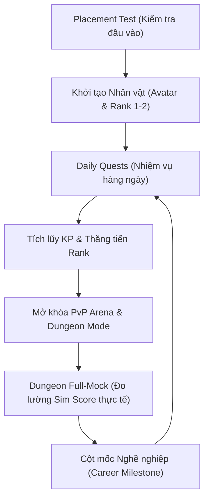

# HƯỚNG DẪN NGƯỜI DÙNG TOÀN DIỆN: TOEIC QUEST RPG HUB
*Chinh phục chứng chỉ TOEIC bằng thế giới nhập vai Cyber Scholar RPG*

Chào mừng các bạn đến với **TOEIC Quest RPG Hub**! Đây là tài liệu hướng dẫn từ đầu đến cuối giúp bạn hiểu sâu sắc các cơ chế của ứng dụng, từ đó tối ưu hóa lộ trình ôn luyện và nhanh chóng đạt được mục tiêu điểm số TOEIC của mình.

---

## MỤC LỤC
1. [Giới Thiệu & Triết Lý RPG Gamification](#1-giới-thiệu--triết-lý-rpg-gamification)
2. [Hành Trình Khởi Đầu (Onboarding)](#2-hành-trình-khởi-đầu-onboarding)
3. [Hệ Thống Nhiệm Vụ Hàng Ngày (Daily Quests)](#3-hệ-thống-nhiệm-vụ-hàng-ngày-daily-quests)
4. [Hệ Thống Chuỗi Ngày Học (Streak)](#4-hệ-thống-chuỗi-ngày-học-streak)
5. [Đấu Trường Đối Kháng 1v1 (PvP Battle Mode)](#5-đấu-trường-đối-kháng-1v1-pvp-battle-mode)
6. [Hầm Ngục Thử Thách (Dungeon Mock Tests)](#6-hầm-ngục-thử-thách-dungeon-mock-tests)
7. [Hệ Thống Cấp Bậc & Cột Mốc Nghề Nghiệp](#7-hệ-thống-cấp-bậc--cột-mốc-nghề-nghiệp)
8. [Chiến Lược Học Tập Đạt Hiệu Quả Tối Đa](#8-chiến-lược-học-tập-đạt-hiệu-quả-tối-đa)

---

## 1. GIỚI THIỆU & TRIẾT LÝ RPG GAMIFICATION

**TOEIC Quest RPG Hub** không phải là một ứng dụng luyện đề TOEIC thông thường. Đây là một nền tảng **Cyber Scholar RPG** (Học giả mạng nhập vai), nơi mỗi đề thi, mỗi từ vựng và cấu trúc ngữ pháp bạn học được chuyển hóa thành vũ khí, điểm kinh nghiệm (KP - Knowledge Points), và năng lực thực chiến của nhân vật.

### Khung động lực học hành vi Octalysis
Ứng dụng áp dụng thiết kế động lực học **Octalysis** nhằm duy trì động lực học tập cao nhất:
*   **Core Drive 2 (Development & Accomplishment - Phát triển & Thành tựu):** Thể hiện qua hệ thống 6 Stats năng lực của nhân vật và thanh tiến trình thăng hạng (Rank-up).
*   **Core Drive 5 (Social Influence & Relatedness - Ảnh hưởng xã hội & Sự liên kết):** Thể hiện qua đấu trường PvP 1v1 real-time, bảng xếp hạng Leaderboard và tính năng Bang hội (Guild Hub).
*   **Core Drive 8 (Loss & Avoidance - Tổn thất & Né tránh):** Thể hiện qua cơ chế duy trì Streak hàng ngày và các hình phạt khi bỏ thi giữa chừng trong Dungeon.

### Vòng lặp trải nghiệm cốt lõi của người học



---

## 2. HÀNH TRÌNH KHỞI ĐẦU (ONBOARDING)

Khi lần đầu bước vào thế giới **TOEIC Quest RPG Hub**, bạn sẽ đi qua 3 bước cốt lõi để thiết lập nhân vật:

### Bước 2.1: Đặt mục tiêu học tập (Goal Setting)
Bạn cần chọn mức điểm TOEIC đích (Listening & Reading) phù hợp với nhu cầu thực tế:
*   **Các mốc điểm tiêu chuẩn:** `300` | `450` | `600` | `750` | `850` | `900+`.
*   **Thời hạn hoàn thành:** `1 tháng` | `3 tháng` | `6 tháng` | `12 tháng`.
*   *Hệ thống sẽ tự động tính toán thời gian và ngày dự kiến bạn cần đạt mục tiêu dựa trên tốc độ học tập tiêu chuẩn.*

### Bước 2.2: Làm bài kiểm tra phân lớp (Placement Test)
Để xác định xuất phát điểm thực tế, bạn sẽ hoàn thành bài thi thử rút gọn gồm **10 câu hỏi đa dạng** (Ngữ pháp, Từ vựng, Nghe hiểu).
*   **Thời gian giới hạn:** 5 phút (nếu hết giờ, hệ thống tự động nộp bài).
*   **Cơ chế đánh giá:** Thuật toán AI sử dụng lý thuyết ứng phó câu hỏi **IRT (Item Response Theory)** để tính toán hệ số năng lực Theta khởi điểm của bạn. Từ Theta, hệ thống quy đổi ra **Sim Estimated TOEIC Score** (Điểm ước tính ban đầu) cực kỳ chính xác.

### Bước 2.3: Chọn Avatar & Nhận Rank ban đầu
Dựa trên kết quả bài Placement Test, bạn sẽ nhận được Cấp bậc (Rank) đầu tiên và được chọn một trong **6 lớp Avatar Chiến Binh** đại diện cho mình trong suốt hành trình học tập.

---

## 3. HỆ THỐNG NHIỆM VỤ HÀNG NGÀY (DAILY QUESTS)

Hệ thống nhiệm vụ hàng ngày là nguồn cung cấp KP chủ yếu giúp nhân vật của bạn thăng tiến sức mạnh.

### Cơ cấu 3 Nhiệm vụ cốt lõi (Core Quests)
Mỗi ngày vào lúc 00:00 (giờ hệ thống), AI Mentor sẽ chuẩn bị 3 nhiệm vụ được cá nhân hóa dựa trên dữ liệu học tập và các chủ điểm bạn còn yếu trước đó:

| Mã Nhiệm Vụ | Tên Nhiệm Vụ | Thời Gian Ước Tính | Nội Dung Luyện Tập |
| :--- | :--- | :--- | :--- |
| **DQ-01** | Quyết Chiến Từ Vựng | 15 phút | Ôn tập từ vựng TOEIC thông dụng theo chủ đề doanh nghiệp. |
| **DQ-02** | Phản Xạ Nghe Hiểu | 10 phút | Luyện nghe tranh, hội thoại ngắn (TOEIC Part 1 - Part 4). |
| **DQ-03** | Đấu Pháp Ngữ Pháp | 5 phút | Điền từ vào câu, chọn cấu trúc ngữ pháp đúng (Part 5). |

### Chỉ số Thể lực (Stamina)
Mỗi ngày bạn có **100 điểm Stamina**. 
*   Mỗi lượt làm Daily Quest hoặc tham gia PvP sẽ tiêu hao Stamina tương ứng.
*   Khi Stamina về `0`, bạn sẽ không thể tham gia PvP để cày ELO hoặc nhận thêm KP nhằm tránh việc người học bị quá tải (burnout).

### Trình phát Quiz & Cơ chế giải thích đáp án 3 tầng (3-Layer Explanation)
Khi thực hiện làm bài trắc nghiệm, bạn sẽ trải qua quy trình phản hồi học tập tối ưu:
1.  **Micro-feedback (Phản hồi siêu tốc < 2 giây):**
    *   **Trả lời đúng:** Màn hình flash xanh, hiệu ứng Confetti lấp lánh và cộng KP tức thì.
    *   **Trả lời sai:** Màn hình flash đỏ, hiển thị đáp án đúng và cộng cho bạn **1 Insight Point** (Điểm Thấu Suốt).
2.  **Giải thích 3 tầng (3-Layer Explanation):**
    Để tránh việc quá nhiều chữ gây nản lòng, hệ thống sử dụng phương thức hiển thị thông tin tăng dần (Accordion):
    *   **Tầng 1 (Mặc định):** Một câu giải thích quy tắc cốt lõi (Ví dụ: *"Trực sau giới từ luôn là một danh từ/V-ing"*).
    *   **Tầng 2 (Bấm Xem Phân Tích):** Phân tích chi tiết thành phần câu, dịch nghĩa toàn bộ câu hỏi và các phương án nhiễu.
    *   **Tầng 3 (Bấm Học Sâu - Tiêu tốn Insight Point):** Hiển thị mẹo học dễ nhớ (Mnemonic), các bẫy thường gặp của ETS và các ví dụ thực tế liên quan.

---

## 4. HỆ THỐNG CHUỖI NGÀY HỌC (STREAK)

Duy trì thói quen học tập hàng ngày là chìa khóa vàng để đạt mục tiêu TOEIC. Hệ thống Streak ghi nhận số ngày liên tục bạn hoàn thành **ít nhất 1 Daily Quest**.

> [!WARNING]
> Nếu bạn bỏ lỡ không hoàn thành bất kỳ nhiệm vụ nào trong ngày trước 24:00, chuỗi Streak của bạn sẽ bị reset về `0`!

Để bảo vệ thành quả của bạn, ứng dụng cung cấp hai cơ chế:

### 1. Băng Trầm Tích (Streak Freeze)
*   **Cách hoạt động:** Cho phép bảo lưu chuỗi Streak nếu bạn bận đột xuất và không thể truy cập ứng dụng học tập.
*   **Chi phí:** Tiêu hao **500 KP** tích lũy.
*   **Giới hạn:** Tối đa sử dụng **1 lần mỗi tuần**.

### 2. Nhiệm vụ Hồi sinh (Streak Recovery)
*   **Cách hoạt động:** Nếu bạn vừa bị đứt chuỗi Streak, trong vòng 24 giờ tiếp theo, bạn có thể thực hiện Nhiệm vụ Hồi sinh đặc biệt.
*   **Yêu cầu:** Bạn cần hoàn thành gấp đôi số lượng bài học thông thường (hoàn thành 2 Core Quests) để kích hoạt khôi phục lại chuỗi Streak ban đầu.

---

## 5. ĐẤU TRƯỜNG PVP ĐỐI KHÁNG 1V1 (PVP BATTLE MODE)

Đấu trường PvP là nơi bạn so tài phản xạ tiếng Anh trực tiếp với các người học khác trên hệ thống.

```
       [Người Chơi A]                                      [Người Chơi B]
             │                                                   │
             ├────────────────── Ghép Trận ──────────────────────┤ (Redis ELO ±100, tối đa 15s)
             ▼                                                   ▼
┌────────────────────────────────────────────────────────────────────────┐
│                        Khởi tranh PvP Arena                            │
│           (Thi đấu 10 câu hỏi trắc nghiệm, 20 giây mỗi câu)             │
└────────────────────────────────────────────────────────────────────────┘
             │                                                   │
             ├─────────────── Gửi đáp án lên Server ─────────────┤ (WebSocket kết nối đồng bộ)
             ▼                                                   ▼
┌────────────────────────────────────────────────────────────────────────┐
│                      Server Xác Thực & Chống Hack                      │
│        (Xác thực đáp án trên Server, kiểm tra độ trễ phản xạ)          │
└────────────────────────────────────────────────────────────────────────┘
             │                                                   │
             ▼                                                   ▼
┌────────────────────────────────────────────────────────────────────────┐
│                      Phân Định Thắng Bại & Trao Quà                    │
│      - Thắng: +30 ELO, +300 KP, rơi vật phẩm Streak Freeze            │
│      - Thua:  -10 ELO, +50 KP khuyến khích, +1 Insight Point           │
└────────────────────────────────────────────────────────────────────────┘
```

### Quy tắc Đấu trường
*   **Điều kiện tham gia:** Bạn phải đạt **Rank 2 (Học Việc)** trở lên và còn Stamina để đấu Ranked.
*   **Cơ chế ghép trận (Matchmaking):** Hệ thống tìm đối thủ có độ lệch điểm ELO không quá **100 điểm** thông qua Redis Sorted Sets trong vòng 15 giây. Quá 15 giây, hệ thống sẽ tự động ghép bạn với BOT thông minh mô phỏng hành vi để tránh chờ đợi.
*   **Quy trình thi đấu:** Trận đấu diễn ra trong 10 câu hỏi trắc nghiệm. Mỗi câu hỏi giới hạn **20 giây phản xạ**. Hệ thống WebSocket sẽ hiển thị tiến độ thời gian thực của đối thủ (Ví dụ: *"Đối thủ đã trả lời!"*) để tăng tính kịch tính.
*   **Phòng chống gian lận:** Mọi lượt chọn đáp án phải được xác thực hoàn toàn trên Server. Nếu Client gửi đáp án nhanh một cách phi lý (ví dụ: < 1 giây cho một đoạn nghe dài), hệ thống sẽ đánh dấu vi phạm và tự động xử thua.
*   **Giới hạn chống nghiện:** Bạn được tham gia tối đa **15 trận PvP mỗi ngày** để cân bằng giữa học thuật và tính giải trí.

---

## 6. HẦM NGỤC THỬ THÁCH (DUNGEON MOCK TESTS)

Dungeon là nơi bạn thử thách bản thân với các đề thi thử TOEIC chuẩn ETS để đo lường chính xác thực lực hiện tại.

### Các loại Dungeon
1.  **Dungeon Thường (Mini Mock Test):** Bài thi rút gọn gồm 50 - 100 câu hỏi, thời gian từ 30 - 60 phút.
2.  **Dungeon Huyền Thoại (Full-Mock Test):** Mô phỏng 100% phòng thi thật với **200 câu hỏi** (100 Listening, 100 Reading) trong **120 phút**.

> [!IMPORTANT]
> **Hình phạt thoát ngang:** Khi đã bước vào Dungeon, phím Thoát nhanh trên điện thoại sẽ bị vô hiệu hóa. Nếu cố tình tắt ứng dụng hoặc mất kết nối quá lâu, hệ thống sẽ tính điểm tại thời điểm đó và phạt trừ một lượng KP đáng kể.

### Cơ chế Tự động Lưu nháp (Dungeon Checkpoint)
Để đảm bảo tiến trình làm bài 2 tiếng không bị ảnh hưởng do cuộc gọi đột xuất hay sự cố kết nối:
*   Hệ thống tự động đồng bộ đáp án của bạn lên máy chủ PostgreSQL sau mỗi **10 câu hỏi**.
*   Nếu xảy ra sự cố đột ngột, bạn có **tối đa 24 giờ** để quay lại Dungeon và tiếp tục làm bài từ Checkpoint gần nhất. Sau 24 giờ, hệ thống sẽ tự động nộp bài và tính điểm phần đã hoàn thành.

### Báo cáo kết quả năng lực
Sau khi hoàn thành Dungeon, AI sẽ chạy thuật toán IRT FastAPI để cập nhật hệ số năng lực Theta của bạn, từ đó:
*   Cập nhật điểm **Estimated TOEIC Score** chính xác trên Profile.
*   Cập nhật biểu đồ Radar hiển thị mức độ biến động của 6 chỉ số Stats năng lực.
*   AI Mentor phân tích và đề xuất lộ trình vượt bẫy (Ví dụ: *"Hãy tập trung luyện tập Part 7 Double Passage"*).

---

## 7. HỆ THỐNG CẤP BẬC & CỔT MỐC NGHỀ NGHIỆP

Hệ thống Rank trong game được thiết kế tương ứng trực tiếp với trình độ tiếng Anh theo khung chuẩn Châu Âu (CEFR) và điểm số TOEIC thực tế, đồng thời ánh xạ trực tiếp đến các mốc phát triển sự nghiệp của bạn ngoài đời:

| Cấp Bậc (Rank) | Huy Hiệu (Badge) | Điểm TOEIC Tương Đương | Điểm KP Yêu Cầu | Cột Mốc Sự Nghiệp Thực Tế (Career Milestone) |
| :--- | :---: | :---: | :---: | :--- |
| **Rank 1: Thực Tập Sinh** | 🌱 | `< 350` | Khởi đầu | Chuẩn bị nền tảng tiếng Anh căn bản, làm quen với thuật ngữ môi trường công sở. |
| **Rank 2: Học Việc** | 🛠️ | `350 - 500` | `2,000` | Đạt chuẩn đầu ra tiếng Anh của một số trường cao đẳng/đại học khối kỹ thuật. |
| **Rank 3: Chuyên Viên** | 💼 | `500 - 650` | `8,000` | Đủ điều kiện ứng tuyển vị trí chuyên viên hoặc Junior tại các công ty đa quốc gia. |
| **Rank 4: Trưởng Nhóm** | 👑 | `650 - 800` | `18,000` | Có khả năng giao tiếp lưu loát, làm việc nhóm trực tiếp với đối tác nước ngoài. |
| **Rank 5: Quản Lý** | 🔮 | `800 - 900` | `35,000` | Đủ điều kiện thăng tiến lên các vị trí Quản lý, Giám đốc bộ phận trong doanh nghiệp FDI. |
| **Rank 6: Giám Đốc** | 🏆 | `900+` | `60,000` | Làm chủ hoàn toàn ngôn ngữ thương mại, đại diện doanh nghiệp thương thảo quốc tế. |

### Lễ Thăng Hạng (Rank-up Ceremony)
Khi bạn tích lũy đủ số KP cần thiết để thăng hạng:
*   Màn hình sẽ hiển thị hoạt họa thăng cấp toàn màn hình vô cùng hoành tráng kéo dài **5 giây** để tôn vinh sự nỗ lực của bạn.
*   Sau lễ thăng cấp, bạn có thể tải về **Thẻ chứng nhận thăng hạng (Social Share Card)** kích thước chuẩn 1080x1080 chứa Avatar, Rank mới của bạn và mã QR để tự hào chia sẻ lên Facebook/Zalo cùng bạn bè.

---

## 8. CHIẾN LƯỢC HỌC TẬP ĐẠT HIỆU QUẢ TỐI ĐA

Để thăng hạng nhanh chóng và cải thiện điểm số TOEIC thực tế một cách vững chắc nhất, hãy tham khảo các mẹo chiến lược sau:

1.  **Duy trì "Kỷ luật 20 phút":** 
    Thời gian học lý tưởng cho mỗi phiên học di động là từ **18 - 25 phút**. Hãy cố gắng hoàn thành 3 Daily Quests mỗi ngày thay vì dồn lại học hàng tiếng đồng hồ vào cuối tuần. Việc duy trì Streak đều đặn sẽ giúp não bộ ghi nhớ kiến thức dài hạn tốt hơn gấp 3 lần.
2.  **Sử dụng Insight Point đúng lúc:** 
    Đừng lãng phí Insight Point thu thập được khi làm sai câu hỏi. Hãy dùng nó để mở khóa **Tầng 3 (Học Sâu)** ở những câu hỏi ngữ pháp khó hoặc các từ vựng dễ nhầm lẫn để nắm vững mẹo làm bài từ AI Mentor.
3.  **Tối ưu hóa chỉ số Thể lực (Stamina):** 
    Hãy ưu tiên giải quyết các bài học Core Daily Quests trước để đảm bảo lượng KP cơ bản và duy trì Streak, sau đó dùng lượng Stamina còn lại để tham gia PvP rèn luyện phản xạ nhanh.
4.  **Lắng nghe AI Mentor gợi ý sau Dungeon:** 
    Sau mỗi lần vượt phó bản Dungeon, hãy xem kỹ phân tích điểm yếu của hệ thống. Nếu AI chỉ ra chỉ số *Grammar Power* của bạn bị giảm sút, hãy lập tức mở **Skill Tree Map** để tập trung ôn luyện lại các Node Ngữ pháp tương ứng.

Chúc các bạn sớm vượt qua các thử thách, thăng cấp lên Rank Giám Đốc và đạt được điểm số TOEIC mơ ước của mình tại **TOEIC Quest RPG Hub**!
